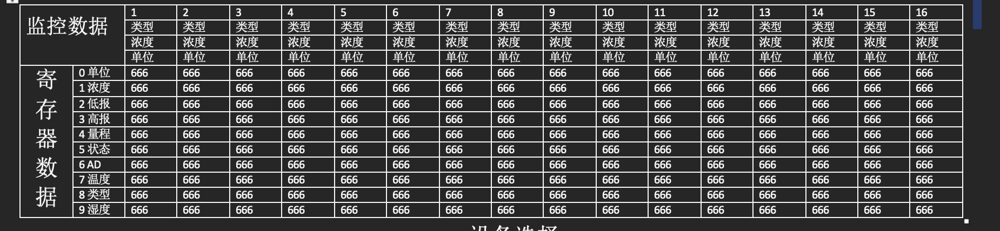

# 串口设置工具

## 数据监视

- 程序打开，读取所有设备的数据按照上表所示
- 寄存器数据中的数据显示原始16进制
- 监控数据根据读取到的值找到对应表格中的字面值，读取到的类型、浓度、单位为16进制数据，需要转换为10进制从表格中读取。
- 串口状态需要区分丢包和没丢包。

## 指令设置

- 选择设备

  - 提供一种方式选择16个设备中的某几个，并提供全选，取消全新操作
  - 指令设置，可以根据需要设置指令类比，分别点击按钮弹出指令设置窗口，每种指令设置的窗口不同（参考协议书册）

- 需要设置指令一共有4种。

  - 标零
    - 指令： FF 01 **01** **60** **00 50** 00 00 00 00 **XX**
    - 其中 XX为手动输入，其它均自动生成

  - 标定点
    - ...